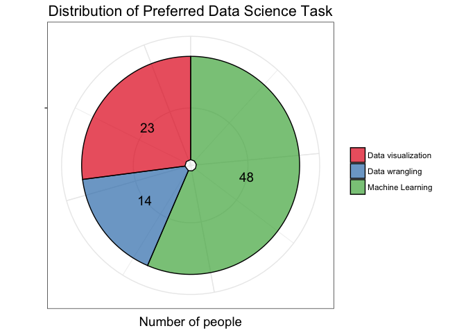
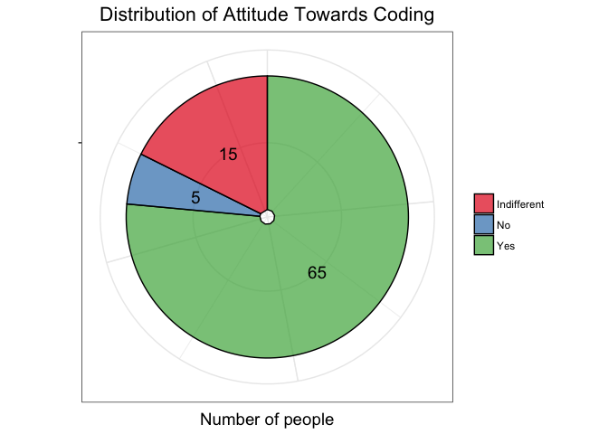
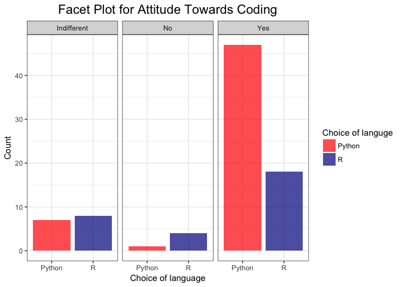
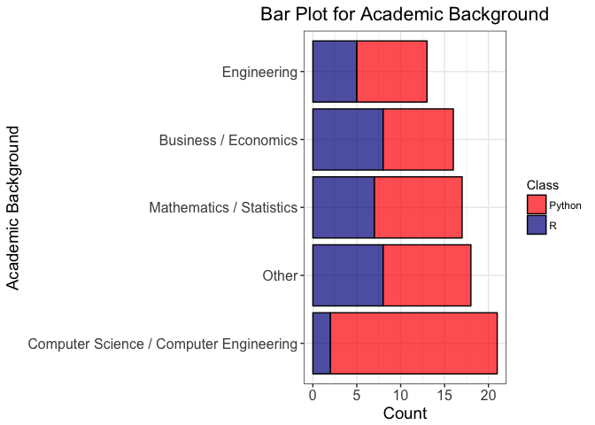
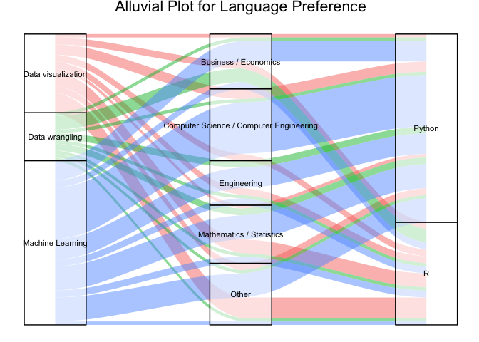
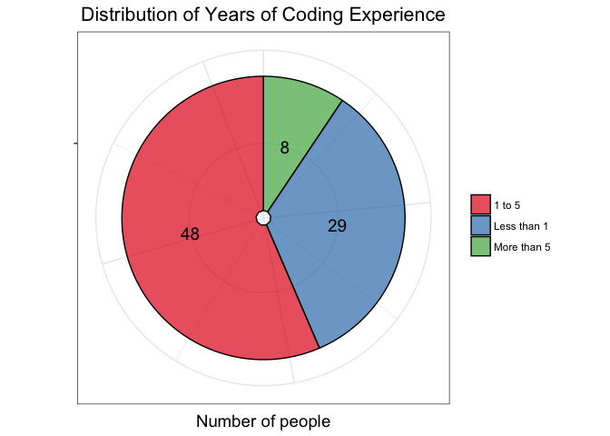
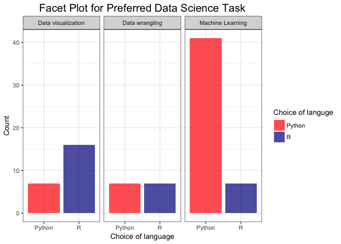
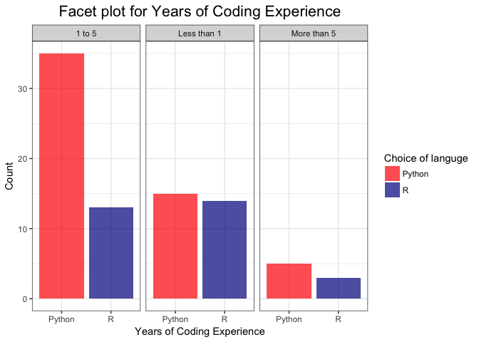
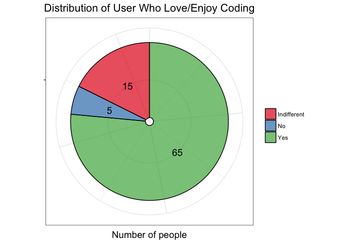

####Introduction 

In continuation of the proposal, we submitted a team last week. We created the survey to capture from the users, so as we can analyze that data collected. We used Survey Monkey as n this data analysis project, we aim to understand how the choice of programming language is affected by the preference of a data science task.We successfully rolled out the survey to people in MDS and elsewhere our main Aim was to get answers to the answers t
 Our main Aim through the survey was to find out answer choice of programming language is affected by the preference of a data science task.

####Methodology 

We created the survey using Google forms since the data is hosted in the US. Users were required to provide their consent to proceed. The survey had 7 easy to follow the question. We succfully rolled out this survey and were managed to get `85 +` responses. The audience targeted were specifically from data science community. Initially, the survey was given to current MDS cohort, faculty and TA's. Then the survey was shared on the various data science channel, wats app groups, and LinkedIn groups. 


####Wrangling 

Data was collected, for analysis and EDA. Data wrangling was done majority to get capture academic background information. The first question `What is your academic background? `  had two options computer science, math-stats and others.  Surprisingly `others` which comprised a lot of option made the second highest in terms of share. We decided to narrow down the option. We narrowed subclassified `others` from survey to (`Engineering`, `Business / Economics`) and rest put everything to `others`.Option for first programming language also was wrangled and all other options were clubbed together. 


```r
survey <- survey %>% 
  rowwise() %>% 
  mutate(background = ifelse(background %in% c("Computer Science / Computer Engineering", "Mathematics / Statistics"), background, 
ifelse(sum((str_detect(tolower(background), c("economics", "business", "finance")))) > 0 , "Business / Economics", ifelse((str_detect(tolower(background), "eng")), 
"Engineering", "Other") ))) %>% 
  mutate(first = ifelse(first %in% c("Python", "R", "Matlab", "SAS", "C", "Java"), first, "Other"))
```

####EDA Plot 

#####Plot 1 

<!-- -->


This is the first graph represents the basic split of the language preference of no of users. The users are primarily people from data science community prefer python and that was not a surprise. 


#####Plot 2

<!-- -->

Bar plot captures the information pertaining to the academic background which is was the most important question of our survey. We think academic background will be a confounding variable, as we can see a various relationship of streams with different programming languages. In total, we captured like `85` responses in total. Maximum no respondents were recent computer science graduates closely followed by mathematics and statistics graduates. One interesting inference that we can conclude would no of people from diverse backgrounds pursuing data science. It is definitely growing at a very steady pace. 


#####Plot 3 and Plot 4 


<!-- --><!-- -->


The second visualization is addressing the second question that is the no of years of coding experience. Our group believes using that this question can very well influence the user choice towards selecting programming language that affects data science task taken. Almost `50%` of the respondents had between `1-5 years` of coding experience. It shows people who had good coding experience are transitioning towards data science. 

One of the questions that were addressed in the survey was no of years coding experience. Decoded to see a relationship between no of years of coding experience and choice of language R or python. We can clearly see python is a clear winner for two categories, but for people who had less than one-year experience in R and python, the response level was same.


#####Plot 5 and Plot 6 


<!-- --><!-- -->

Plots above we  tried visualizing the question ` Do you enjoy/love coding?`. The first graph pie chart, we can clearly see the majority of people love coding from the respondents. Now we tried to see what can be the relationship between `R and python`. We can see respondents who loved coding their preferred language was python, and for the people who didn't like coding their preferred language is R. There shows python is a preferred language than R for data science professionals. 

#####Plot 7

<!-- -->


We asked respondents about their first programming language and seeing their transition to either R or python. We think person first programming language is very influential and it can decide what other language people pick up.  Other language had some traditional language like Basis, Dos, and Pascal etc. Majority of our respondents `C` was their favorite language followed by python. 


#####Plot 8 and Plot 9
<!-- --><!-- -->


What is your favorite data science task?

Plots above, tried addressing what is your favorite Data science task. `Data Wrangling`, `Data Visualization` or `Machine Learning` and relating these task to which programming language you prefer more. For Machine learning clearily `python`  is preferred language. For Data visualization, `R` is a preferred language.  Interestingly for wrangling `python` and `R` were equally preferred. 


### Plot 10 
<!-- -->


This graph tried addressing `How many programming languages do you use actively?`.  Maximum no of users prefer two languages out of the respondents.  People who knew 3 languages, python was a preferred language. 


### Plot 11
<!-- -->


If we look at graph above it shows the relationship between the tasks `Data Viz , Data Wrangling and Machine Learning` and the preferred languages `Python and R`.

#####Conclusion 

After looking at the plots above, data appears to be promising for further analysis for final milestone. It appears some of the variables are confounders. 


