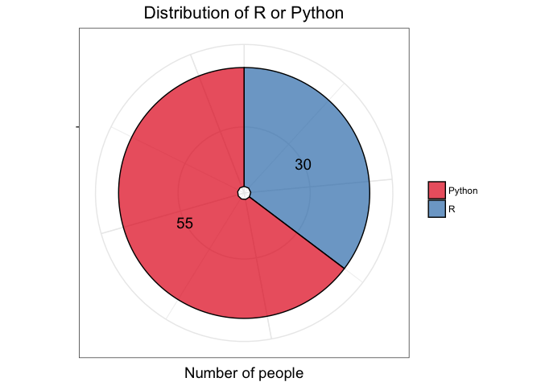
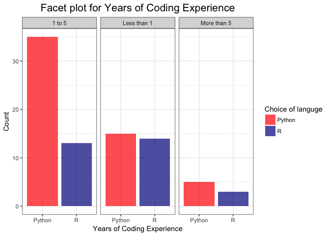
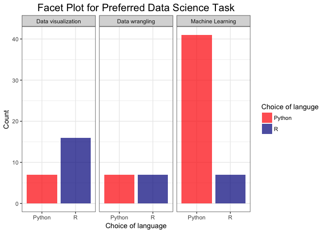

<!-- -->

<!-- -->

<!-- --><!-- -->


<!-- --><!-- -->

<!-- -->


<!-- --><!-- -->


<!-- -->


```
## Missing alluvia for some stratum combinations.
## Missing alluvia for some stratum combinations.
## Missing alluvia for some stratum combinations.
```

<!-- -->

