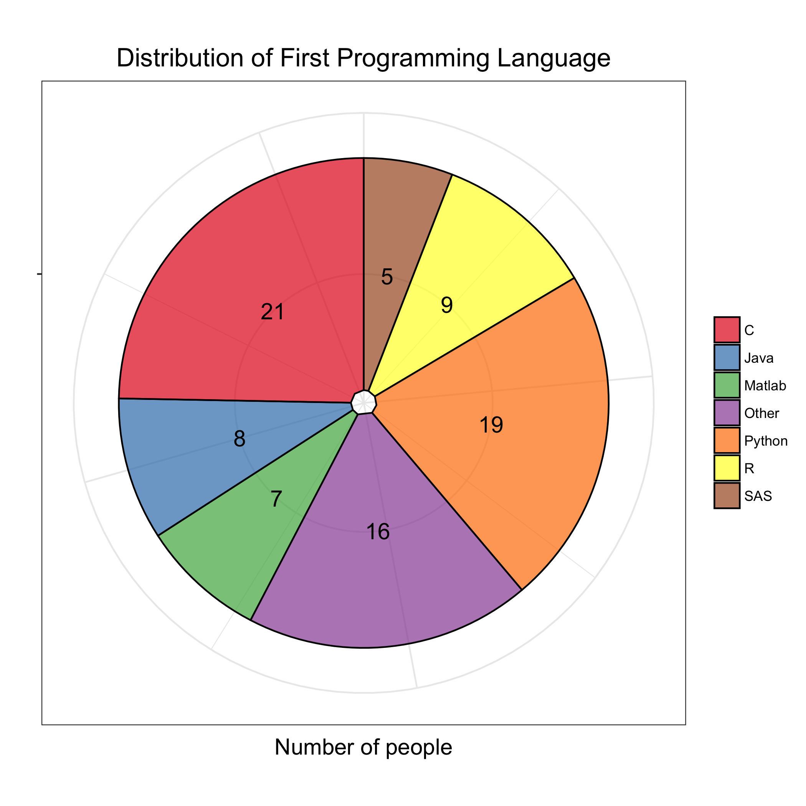
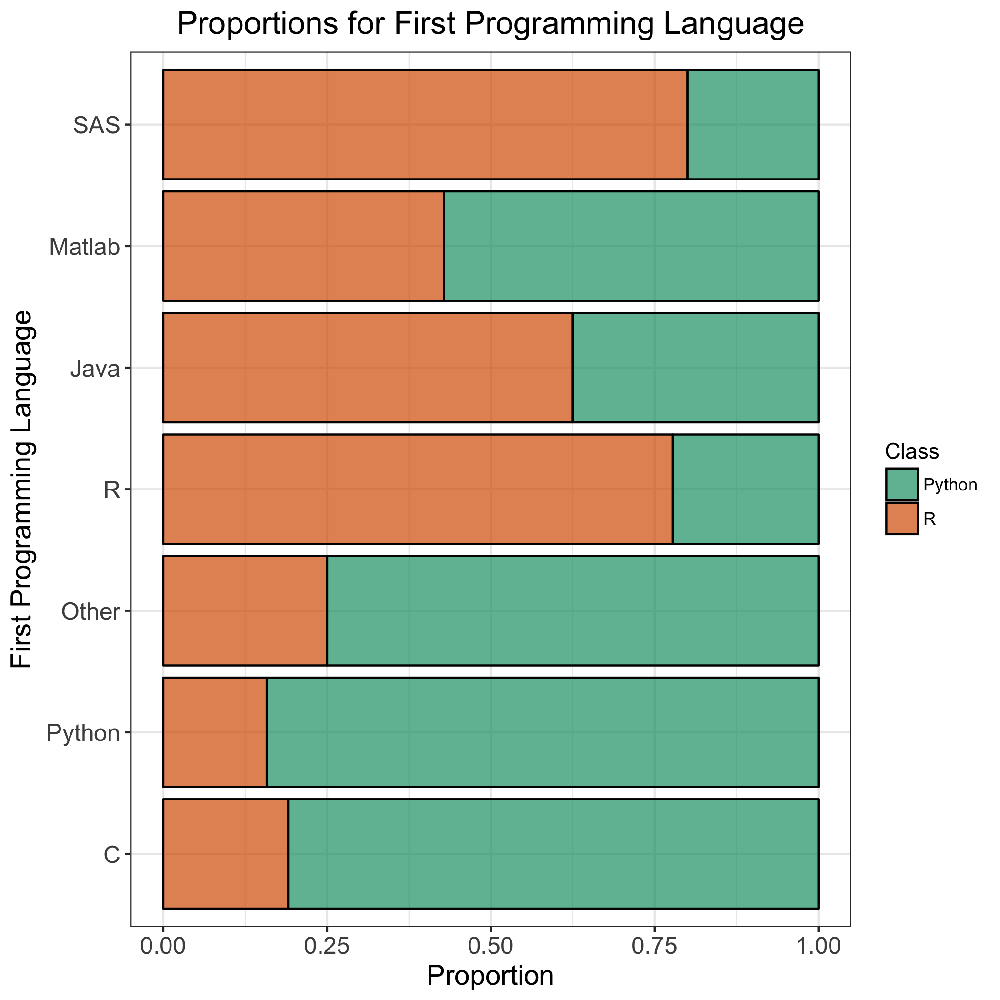

```{r setup, include=FALSE}
knitr::opts_chunk$set(echo = TRUE)
```


<style>

.middle {
text-align: center;
}

</style>

<div class = "middle">


</div>

<div class = "middle">


</div>

<div class = "middle">


</div>

<div class = "middle">


</div>

<div class = "middle">


</div>

<div class = "middle">


</div>