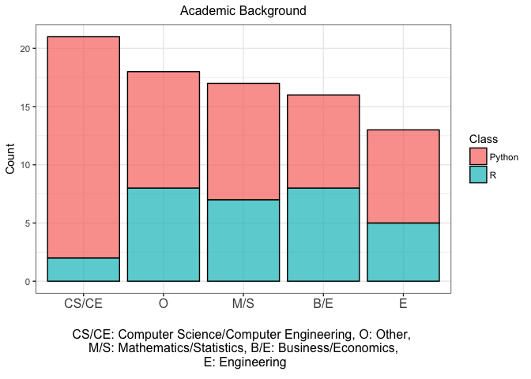
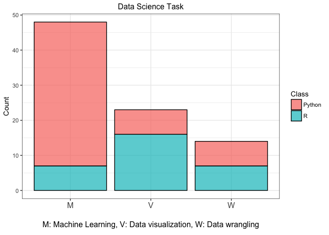
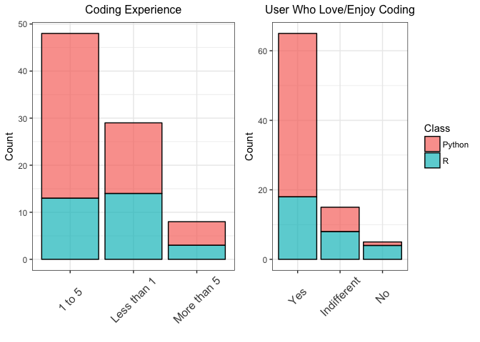
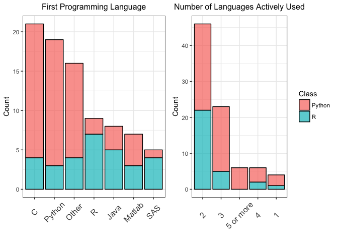
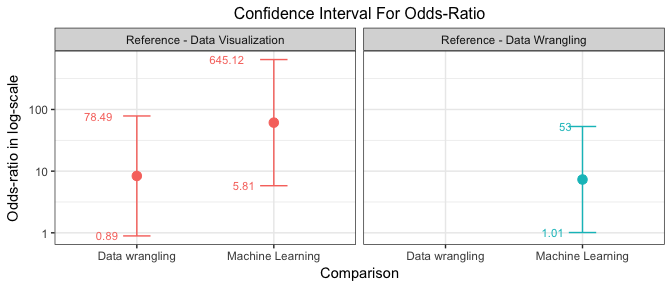

Data Science Language Analysis
================
Avinash Prabhakaran, Nazli Ozum Kafaee, Prash Medirattaa
2018-04-22

Introduction
============

It is common to hear from people working with data that they have a clear choice between R and Python. Almost everyone who has worked with both R and Python have one or the other as their favorite. We were curious to know if there could be a specific reason underlying such choice. After some brainstorming, we came up with the hypothesis that a person's choice between R and Python might be due to their preference in a specific data science task such as data visualization, data wrangling and machine learning. This hypothesis was solely based on our observation and personal experience. However, we have set the goal to explore such causal relationship (if there exists one) with data in our data analysis project.

Methodology
===========

Data collection
---------------

Our primary data source was an online survey created on Google Forms and distributed to the MDS cohort, faculty and teaching assistants through slack channels as well as through contacts in the authors' Linkedin and Whatsapp network. In the end, we managed to collect 85 responses.

One of the concerns we had to address was storage of collected data. Since we used Google Forms for our survey, the data was hosted in the US. Assuming that a great majority of our respondents were Canadian residents, we had to inform them of the fact that the data being collected is hosted in the US and take their consent before proceeding further in the survey. More information on this matter can be found in the [UBC Office of Research Ethics - Using Online Surveys](https://ethics.research.ubc.ca/sites/ore.ubc.ca/files/documents/Online_Survey-GN.pdf) document.

Study Design
------------

In our survey, we wanted respondents to answer two main questions:

-   Which of the following programming languages do you prefer more?
    *Possible answers:* "R" / "Python"

-   What is your favorite data science task?
    *Possible answers:* "Data wrangling" / "Data visualization" / "Machine Learning"

In the former, respondents were required to choose between "R" and "Python" . In the latter, they could choose one from the three options of "Data wrangling", "Data visualization" and "Machine Learning". The answers to these two questions would provide us with the information for the dependent and independent variables in our analysis, respectively.

In order to fully discover the causal relationship between task preference and language preference, we also collected data about factors that could have an effect on both of our dependent and independent variable. The primary goal of collecting information on possible confounding variables was to ensure that we can control for these in our analysis later on. We determined five possible confounding variables for which we asked the following questions:

-   What is your academic background?
    *Possible answers:* "Computer Science/Computer Engineering" / "Mathematics/Statistics" / "Other"

-   How many years of coding experience do you have prior to using Python/R?
    *Possible answers:* "Less than 1" / "1 to 5" / "More than 5"

-   Do you enjoy/love coding?
    *Possible answers:* "Yes" / "No" / "Indifferent"

-   Which programming language did you learn first?
    *Possible answers:* "Python" / "R" / "SAS" / "Matlab" / "C" / "Java" / "Other"

-   How many programming languages do you use actively?
    *Possible answers:* "1" / "2" / "3" / "4" / "5 or more"

We thought that academic background would be a confounding variable as people with Computer Science/Computer Engineering background would have been introduced to Python as part of their degree and people from Mathematics/Statistics degrees would have been introduced to R in general. However, we did not anticipate any bias towards R or Python by graduates of any other degrees. We also believed that the amount of coding experience could be a confounder as it can indicate how open the user is in selecting a statistical programming language over a general-purpose programming language. However, we also realized that it was possible that a user could become highly opinionated when they have more experience, and they might prefer Python. Therefore, we wanted to include this variable in our survey as it would be interesting to analyze the same. Another variable on which we wanted to collect information was the user's attitude towards coding. The outlook towards coding could be a confounder as Python is a general-purpose programming language and it can be used in various areas, and its application is not limited to Data Science/Statistics whereas R is a statistical programming language and is mainly used in the fields of Data Science and Statistics. Again, a person's first programming language would be very influential as it dictates their style of coding and would also be a deciding factor in what they seek in other languages. Some of the programming languages are more closely related to Python whereas some others are more related to R. The number of programming languages a person actively uses could be a deciding factor too as it can indicate how comfortable the user is with different syntaxes and also how flexible the user is.

Our survey can be accessed fully [here](https://goo.gl/forms/zdl0VlHK2NwAfflE3).

Analysis Methods
----------------

The data collected as a result of our survey was downloaded as a `csv` file and imported into R for analysis. All data wrangling and visualization were done in the R computing environment. The code chunks that download data, apply wrangling and create plots can be found in [read\_data.R](../src/read_data.R), [clean\_data.R](../src/clean_data.R) and [get\_plots.R](../src/get_plots.R), respectively.

Exploratory Data Analysis
=========================

Wrangling
---------

The data collected from the survey required some initial wrangling in order to be prepared for exploratory and statistical data analysis. The main goal in wrangling was to organize answers that came from the "Other" answer option which enabled respondents to freely type their answer for a specific question if their answer did not correspond to any of the answer options provided.

The first question in our survey was "What is your academic background?". This question had three main options: "Computer Science / Computer Engineering", "Mathematics / Statistics" and "Other". We saw that "Other" comprised a lot of different answers and made the second highest in terms of share. We decided to split "Other" category and create new categories as we saw that there were some major categories that appeared repeatedly but were typed differently. For example, the answers in the form of "business", "Business", "business and economics", etc. all pointed out to the same category but appeared as distinct categories in the raw data. In fact, two such categories we observed were engineering and business studies. Therefore, we added "Engineering" and "Business/Economics" as new categories to the academic background variable and left the rest to "Other". Our final categorization of the academic background variable can be seen below together with the distribution of preference between R and Python in each category.



We faced another issue in the answers to the question which asked respondents about the first programming language they learned. Again, we gave respondents six main options to choose from and an "Other" option to fill in if necessary. They could freely type the name of their first programming language if it was not one of the predetermined languages listed. We observed that none of the languages that we had listed represented a major group of people and the highest number of respondents chose "Others". The "Other" option comprised of varying languages but each had only one or two respondents. So the responses did not indicate any meaningful pattern. Therefore, we aggregated all answers in "Other" and kept the options unchanged.

Visualizations
--------------

Our primary goal was to see how the preference between R and Python changed depending on a person's favorite data science task. In the plot below, we can see that Python is more popular among people whose preferred data science task is machine learning. However, R seems to be the preferred language when it comes to data visualization. In the data wrangling category, there is an equal split between R and Python.



We had mentioned earlier that we should not forget about confounders and needed to take them into account when looking at the relationship between our dependent and independent variables. These confounders might be the real reason for the proportional difference we observe in the plot above. Therefore, concluding a causal inference without careful consideration of the possible confounders would be naive. We made use of stacked bar plots in order to see the difference in the preference between R and Python depending on each category in our possible confounding variables. As can be seen in the plots below, we have observed that the proportion between the two languages changes depending on a person's experience in coding. Novice coders (`Less than 1`) prefer Python around 50% of the time whereas this proportion increases to around 60% for Intermediate (`1 to 5`) and experienced coders (`More than 5`). We can observe a proportional difference, but this difference does not seem to be significant. Also, we should keep in mind that the number of respondents in each category are not equal and these proportions might have been similar or more different if we could have collected data equally in each category.



We have observed that the first programming language has some effect on the choice between R and Python. People who have learned a statistical programming language (`R`, `Matlab`, `SAS`) as their first language seem to be leaning more towards R whereas this is the reverse for those groups that have learned a general-purpose programming language (`C`, `Python`) as their first language.



Statistical Analysis
====================

Our dependent variable has two categories, `R` and `Python`. So it is a binary variable (Python is coded as 1). Our independent variable has three categories. Therefore, we found it appropriate to use a `glm` model with logit link function as logistic regression is useful with binary random component and mixed systematic components.

Within the specified type of model, we tried using different variables and assessed all of them before deciding on one option. The models we have explored and their AIC scores can be seen below and further results can be found in [analysis.pdf](../results/analysis.pdf) in this repository.

| Sno | Models                                                                  |     AIC|
|:----|:------------------------------------------------------------------------|-------:|
| 1   | preference ~ task                                                       |  93.555|
| 2   | preference ~ task + background + experience + attitude + first + active |  90.394|
| 3   | preference ~ task + background + experience + first + active            |  88.420|
| 4   | preference ~ task + background + first + active                         |  86.694|
| 5   | preference ~ task + background + first                                  |  90.428|
| 6   | preference ~ task + background + active                                 |  90.411|
| 7   | preference ~ task + first + active                                      |  89.657|

We considered the `AIC` score and interpretability when deciding on our final model. Primarily, we tried to choose the model with the lowest AIC score. However, this led us to models that were too complicated and very hard to interpret. Therefore, we tried to hold a balance between the goodness-of-fit with AIC score and the interpretability by limiting the complexity of the model.

``` r
#Final Model with only first language as confounder
final_model <- glm(preference ~ task + first, family = binomial(link = 'logit'), data = data)
```

| term                      |    estimate|    std.error|   statistic|    p.value|
|:--------------------------|-----------:|------------:|-----------:|----------:|
| (Intercept)               |  -4.9757137|     2.937877|  -1.6936424|  0.0903333|
| taskData wrangling        |   2.1236230|     1.119660|   1.8966683|  0.0578717|
| taskMachine Learning      |   4.1142174|     1.177611|   3.4936976|  0.0004764|
| backgroundComputer Sc/Eng |   3.8720513|     1.679999|   2.3047938|  0.0211781|
| backgroundEngineering     |  -0.3728615|     1.279972|  -0.2913043|  0.7708186|
| backgroundMaths/Stats     |   0.4743432|     1.013767|   0.4679016|  0.6398550|
| backgroundOther           |   0.4333682|     1.245611|   0.3479161|  0.7279032|
| firstJava                 |  -2.0700504|     1.448983|  -1.4286232|  0.1531126|
| firstMatlab               |  -0.6066711|     1.527798|  -0.3970885|  0.6913022|
| firstOther                |   0.6676056|     1.205338|   0.5538741|  0.5796650|
| firstPython               |   3.0142724|     1.604886|   1.8781850|  0.0603559|
| firstR                    |  -0.9333257|     1.423147|  -0.6558183|  0.5119411|
| firstSAS                  |  -0.6027816|     1.758794|  -0.3427245|  0.7318058|
| active2                   |   1.4009353|     2.161975|   0.6479886|  0.5169924|
| active3                   |   3.8921539|     2.383033|   1.6332775|  0.1024107|
| active4                   |   2.7215844|     2.683512|   1.0141875|  0.3104933|
| active5 or more           |  20.2088781|  2047.081999|   0.0098720|  0.9921234|

Additionally, we adopted a stepwise methodology to validate the results. We did manual backward elimination to ensure that the `task` variable is present in the final model.

``` r
#Feature selection using stepwise
sw_model <- step(model.2, direction = "both", trace=FALSE)
```

**Selected model:** `preference ~ task + background + first + active`

$$logit(p) = log(\\frac{p}{1-p}) = \\beta\_0 + \\beta\_1 \* \\text{task} + \\beta\_2 \* \\text{background} + \\beta\_3 \* \\text{first} + \\beta\_4 \* \\text{active}$$

**Assumptions**

-   In our study, there are three confounding variables(Academic background, first programming language and the number of languages actively used).

-   No interactions were there between explanatory variables and the confounding variables in the model.

-   There is also no interaction between the confounding variables themselves.

Results
=======

| Comparison       | Reference          |  Estimate|  Std.Error|    p.value|  Odds-Ratio|    LowerCI|    UpperCI|
|:-----------------|:-------------------|---------:|----------:|----------:|-----------:|----------:|----------:|
| Data wrangling   | Data visualization |  2.123623|  1.1196597|  0.0578717|    8.361376|  0.8907456|   78.48774|
| Machine Learning | Data visualization |  4.114217|  1.1776112|  0.0004764|   61.204296|  5.8065990|  645.12220|
| Machine Learning | Data wrangling     |  1.990594|  0.9898468|  0.0443241|    7.319883|  1.0109604|   52.99979|

-   People whose favorite task is Data Wrangling are 8.4 times more likely to select Python as their favorite language compared to people whose favorite task is Data Visualization.

-   People whose favorite task is Machine Learning are 61.2 times more likely to select Python as their favorite language compared to people whose favorite task is Data Visualization.

-   People whose favorite task is Machine Learning are 7.3 times more likely to prefer Python as their favorite language compared to people whose favorite task is Data Wrangling



We also provide the confidence intervals of these point estimates in the plot above. This plot shows that our point estimates have quite wide confidence intervals indicating some uncertainty. Out of these intervals, the comparison of Machine Learning category against Data Visualization is relatively wider, ranging from 5.81 to 645.12.
